```mermaid
graph TD
    subgraph Browser["Web Frontend (apps/web)"]
        UI_Chat["Chat & Thinking Panel<br/>(思維鏈、對話、審批)"]
        UI_Question["Question Card<br/>(互動決策提問與選項反饋)"]
        UI_RateLimit["RateLimit Card<br/>(429 配額倒數與緩解指示)"]
        UI_Subagent["Subagent Panel<br/>(多代理人即時監控)"]
        UI_Editor["Monaco Editor & Diff<br/>(程式碼檢視與差異比對)"]
        UI_Tree["File Explorer<br/>(專案目錄樹與即時診斷)"]
        UI_Term["Xterm.js Terminal<br/>(即時指令輸出)"]
        UI_MCP["MCP Manager<br/>(工具伺服器視覺化管理)"]
    end

    subgraph Server["Backend Server (apps/server)"]
        WS_Gateway["WebSocket Gateway<br/>(多會話路由、提問推播、事件排程)"]
        Router_Mod["Modular Routers & DoS Guard<br/>(Auth, DB, MCP, Models, Skills, Checkpoints)"]
        DB_Service["SQLite Encrypted Vault<br/>(AES-256-GCM 憑證、對話、設定)"]
        FS_Service["Workspace FS Service<br/>(檔案讀寫、Diff 計算、路徑防護)"]
        PTY_Service["Terminal PTY Service<br/>(跨平台偽終端行程)"]
    end

    subgraph AgentCore["Agent Core Engine (packages/agent-core)"]
        Session_Tasks["Multi-Session Task Manager<br/>(對話隔離與背景並行排程)"]
        State_Machine["Task State Machine<br/>(思考、工具調用、提問暫停、自癒閉環)"]
        Subagent_Mgr["Subagent Orchestrator<br/>(Researcher, Coder, Reviewer 沙盒)"]
        Auto_Tester["Auto Test Runner<br/>(技術棧探測、堆疊擷取、自癒閉環)"]
        Syntax_Linter["Syntax & Linter Service<br/>(TS AST 極速解析、JSON、ESLint)"]
        Git_Checkpoint["Git Checkpoint Service<br/>(影子快照、Worktree 隔離、生命週期修剪)"]
        MCP_Client["MCP Client / Manager<br/>(JSON-RPC 2.0 stdio 協議)"]
        Rate_Limiter["Rate Limit Parser<br/>(TPM/RPM/429 診斷與等待時間計算)"]
        Context_Mgr["Context Window Manager<br/>(Token 防爆截斷、歷史裁剪)"]
        Tool_Runner["Tool Registry<br/>(檔案、搜尋、指令、提問、多代理人)"]
        LLM_Adapter["Multi-Provider Adapters<br/>(Antigravity, Claude, OpenAI, Ollama, OpenRouter)"]
    end

    UI_Chat <-->|WebSocket| WS_Gateway
    UI_Question <-->|WebSocket| WS_Gateway
    UI_RateLimit <-->|WebSocket| WS_Gateway
    UI_Subagent <-->|WebSocket| WS_Gateway
    UI_Editor <-->|WebSocket| WS_Gateway
    UI_Tree <-->|WebSocket| WS_Gateway
    UI_Term <-->|WebSocket| WS_Gateway
    UI_MCP <-->|REST API| Router_Mod

    WS_Gateway <--> Session_Tasks
    Session_Tasks --> State_Machine
    Router_Mod <--> DB_Service
    WS_Gateway <--> FS_Service
    WS_Gateway <--> PTY_Service

    State_Machine --> Subagent_Mgr
    State_Machine --> Auto_Tester
    State_Machine --> Syntax_Linter
    State_Machine --> Git_Checkpoint
    State_Machine --> MCP_Client
    State_Machine --> Rate_Limiter
    State_Machine --> Context_Mgr
    State_Machine --> Tool_Runner
    State_Machine --> LLM_Adapter
```

# Harni

> **純網頁版自主 Coding Agent 開發平台 (Web-based Autonomous Coding Agent IDE)**  
> 獨立封裝自主編程核心引擎，搭配瀏覽器端現代化雙欄式 IDE 介面（Monaco Editor + Monaco Diff 比對器 + Xterm.js 終端機 + Agent 思考鏈面板）。  
> 內建 **階層式多代理人編排 (Multi-Agent)**、**互動式決策釐清工具**、**自動測試驅動修復 (Auto Test-Driven Repair)**、**語法與 Linter 即時回饋**、**Git 快照與 Worktree 隔離沙盒**、**MCP (Model Context Protocol) 整合**、**多服務商官方 OAuth 2.0 認證**、**串流 DoS/OOM 防護** 與 **SQLite AES-256-GCM 加密保險箱**。

---

## 核心特色

- **純網頁跨平台 IDE**：
  - 無需安裝本機 VS Code 外掛，在任何現代瀏覽器即可與自主 Coding Agent 協同開發。
  - 雙欄式 (2-Column) 專注視圖：左側目錄樹與多對話工作區，右側全幅對話流、思考鏈手風琴、Monaco 代碼檢視、Diff 比對與 Xterm.js 終端。
- **階層式多代理人編排 (Hierarchical Multi-Agent Orchestration)**：
  - 主代理人可透過 `invoke_subagent` 並行召喚專業子代理人（Researcher 唯讀研究、Coder 實作、Reviewer 審查、Architect 架構規劃、Self 繼承工具）。
  - **Context 隔離與權限沙盒**：子代理人擁有獨立的上下文視窗與角色工具權限，避免污染父級 Token 視窗。
  - **深度防護 (Depth Guard)** 與可視化監控：防止遞迴自激調用，前端提供 `SubagentPanel` 即時串流多代理人進度與隨時終止。
- **互動式提問與決策釐清 (`ask_question` & `QuestionCard`)**：
  - 當架構方向分歧或需求模糊時，Agent 主動調用 `ask_question` 工具發起結構化選項提問卡片。
  - 前端以 `QuestionCard` 渲染題目背景、單選/多選選項切換與自訂補充文字框，使用者確認後無縫恢復 Agent 自主編程。
- **版本控制：Git Checkpoint 快照、一鍵復原與 Worktree 隔離沙盒**：
  - **自動影子快照 (Shadow Commit / Stash)**：Agent 修改代碼前自動建立 `refs/cline/checkpoints/<id>` 快照，乾淨與未暫存骯髒工作區均受完整備份保護。
  - **一鍵無損還原 (One-Click Revert)**：頂部常駐「還原到本次任務前 (Rollback)」按鈕，一鍵還原 commit、物理清理任務期間新增的 untracked 檔案並恢復使用者的 stash。
  - **Git Worktree 隔離沙盒**：在 `.cline-worktrees/<sessionId>` 建立獨立分支進行探索，Windows NTFS Junction / POSIX Symlink 零額外磁碟開銷，徹底不干擾主工作區。
  - **生命週期修剪**：自動依 `maxRetained` 修剪過期快照，定期清理無效的 `cline/task-*` 孤兒分支。
- **自動測試驅動修復 (Auto Test-Driven Repair / Self-Correction)**：
  - Agent 在修改代碼後，系統自動於背景觸發單元測試（智慧探測 `pnpm test`, `npm test`, `pytest`, `cargo test`, `go test` 或自訂指令）。
  - **自癒閉環**：若測試失敗，系統精準擷取錯誤堆疊 (Error Stacktrace) 並自動注入為下一輪 Observation，讓 Agent 自主修復直到測試全數通過才通知使用者（具備熔斷保護）。
- **語法與 Linter 即時回饋 (Real-time Syntax & Linter Feedback)**：
  - Agent 執行 `write_to_file` 或 `replace_file_content` 後，後端自動調用 TypeScript Compiler AST 記憶體內極速解析（< 5ms）與 ESLint。
  - 若有語法或規則錯誤，行號、欄號、錯誤碼與修復指引即時附加於 `ToolResult` 尾端，促使模型在下個 Turn 立即修正。
- **智慧頻率限制診斷 (Rate Limit Diagnostics)**：
  - 精確解析 TPM (Tokens per minute)、RPM (Requests per minute)、RPD、Rolling Window 等 429 錯誤特徵。
  - 前端以 `RateLimitCard` 呈現友善倒數指示與模型切換建議，取代冰冷錯誤堆疊。
- **Model Context Protocol (MCP) 完整整合**：
  - 支援 JSON-RPC 2.0 over stdio 標準協定，無縫串接外部 MCP 工具與資源伺服器。
  - 提供前端視覺化 MCP 管理面板、精選市集（GitHub, PostgreSQL, Playwright 等）與設定熱重載（Hot-Reload）。
- **多對話背景持續執行與狀態隔離 (Multi-Session Isolation)**：
  - 各對話任務由獨立的狀態機與背景佇列處理，切換對話或新增任務不中斷運算。
  - 側邊欄即時呈現各對話的動態狀態徽章（推理中、生成中、執行中、待審批、測試中）。
- **Token 預算防爆與集中式 Context 解析**：
  - 智慧過濾二進位檔案，自動套用 `.gitignore`，檔案讀取與全文搜尋自動超長截斷保護。
  - 內建 4 級分層解析體系，精準適配 Gemini 3.8 (2M)、Claude 3.7 (200k)、OpenAI o3 (200k) 等主流模型 Context Window。
- **串流 DoS/OOM 防護與 SQLite AES-256-GCM 本機加密保險箱**：
  - HTTP 伺服端即時計數資料流，超出 10MB 硬上限立即熔斷並回傳 413 Payload Too Large。
  - API 金鑰與 OAuth Token 全數由後端 `SecurityService` 透過 PBKDF2/Scrypt 與 AES-256-GCM 加密存入本地 SQLite (`~/.harni/harni.db`)，絕不洩漏至前端。
  - 對話歷程、目錄設定與 MCP 配置全面本地持久化。
- **主流服務商官方 OAuth 2.0 / 訂閱整合**：
  - **Google Antigravity / Gemini**：直連 `accounts.google.com` 官方授權或 API 認證，存取 Gemini 3.8 / 3.7 / 2.5 旗艦模型。
  - **Anthropic Claude (Pro / Max)**：Claude Code 相容 PKCE 授權，直接使用訂閱額度驅動 Claude 3.7 / 3.5 Sonnet。
  - **OpenAI (Plus / Pro)**：Codex 相容 PKCE 授權，使用 ChatGPT 方案內含額度。
- **Agent Skills 專業技能系統**：
  - 內建 15+ 款常用 SOP 技能（包含 `memory-bank`, `git-commit-from-memory`, `grill-me`, `code_review` 等），支援前端技能選單一鍵填入與工作區 `.skills/*.md` 自動載入。

---

## 系統架構 (Monorepo)

專案採用 **pnpm Monorepo** 全 TypeScript 架構：

```
harni/
├── packages/
│   ├── types/               # 前後端共用 TypeScript 型別與 WebSocket Event Schemas
│   └── agent-core/          # 獨立 Coding Agent 核心引擎 (狀態機, Subagents, AutoTest, Linter, MCP, RateLimit, AskQuestion)
└── apps/
    ├── server/              # Node.js HTTP (DoS防護) + WebSocket + PTY 終端 + SQLite 加密保險箱
    ├── web/                 # React 19 + Vite + TailwindCSS + Monaco + Xterm.js 網頁 IDE
    └── desktop/             # Electron 桌面端整合應用
```



---

## 快速開始 (Quick Start)

### 1. 環境需求
- **Node.js** >= 20.0.0
- **pnpm** >= 9.0.0

### 2. 安裝依賴
```bash
# 複製專案
git clone https://github.com/<your-username>/harni.git
cd harni

# 安裝所有相依套件
pnpm install
```

### 3. 啟動開發伺服器
一鍵啟動後端伺服器 (Port 3001) 與前端 Web 介面 (Port 3000)：
```bash
pnpm dev
```

開啟瀏覽器造訪 **`http://localhost:3000`**，即可開始體驗專屬 Coding Agent IDE！

---

## 模型配置與服務商認證

### 使用 Google Antigravity / Gemini (Gemini 3.8 / 3.7 / 2.5)
若需要使用 Google Antigravity / Gemini 系列旗艦模型，可搭配獨立開源的 **[antigravity-bridge](https://github.com/jerrymds/antigravity-bridge.git)** 橋接服務使用：

1. **取得並啟動 Antigravity Bridge**：
   - 造訪開源專案：[https://github.com/jerrymds/antigravity-bridge.git](https://github.com/jerrymds/antigravity-bridge.git)
   - 依照該專案說明啟動 Bridge 伺服器（預設監聽 `http://127.0.0.1:8123`）。
2. **在 Harni 中設定**：
   - 開啟右上角 **設定 (Settings)** -> **模型 (Models)**。
   - 服務商選擇 **Google Antigravity**。
   - 點擊「**執行 Google 身份認證**」，瀏覽器將彈出 Google 官方 OAuth 授權登入頁面（`accounts.google.com`）。
   - 登入並同意授權後，認證資訊將自動以 **AES-256-GCM 加密存入本地 SQLite**，即可透過 Bridge 無縫調用 Gemini 系列旗艦模型！

### 使用 Claude 訂閱登入 (Pro / Max)
1. 設定 -> 模型，服務商選擇 **Anthropic Claude**。
2. 點擊「**使用 Claude 登入**」，新分頁開啟 `claude.ai` 授權頁。
3. 同意授權後 claude.ai 會顯示一段 `code#state` 授權碼，**複製整段**貼回設定頁的輸入框，按「完成登入」。
4. `sk-ant-oat…` 權杖以 **AES-256-GCM 加密存入本地 SQLite**（`anthropic-oauth` 槽），到期自動續期。模型清單切換為訂閱可用的 Claude 系列。

### 使用 OpenAI 訂閱登入 (Plus / Pro)
1. 設定 -> 模型，服務商選擇 **OpenAI GPT**。
2. 點擊「**使用 OpenAI 登入**」，在 OpenAI 官方頁面完成 ChatGPT 帳號授權。
3. 授權頁會回到本機 `localhost:1455` 完成 PKCE 登入；請確保該連接埠未被占用。
4. 登入後會切換為訂閱可用的 Codex 模型。若另行儲存 OpenAI API Key，直接 API Key 優先。

### 使用其他 Provider
在設定頁面選擇對應服務商（如 Cline API, Ollama, OpenRouter, DeepSeek 或自訂相容網關），輸入 API Key 與 Base URL 即可。

---

## 執行自動化測試

專案使用 **Vitest** 構建完整的多層級測試體系：

```bash
# 執行全專案自動化測試
pnpm test

# 單獨測試 Agent Core 引擎 (包含狀態機、多代理人編排、自癒測試、語法 Linter、MCP、Git 快照、提問等)
pnpm test:core

# 單獨測試後端伺服器 (包含 WebSocket 協議、多對話隔離、SQLite、PTY、DoS 串流防護等)
pnpm test:server

# 單獨測試前端 React 元件與 Zustand Store (包含 QuestionCard、RateLimitCard、SubagentPanel 等)
pnpm test:web

# 產出全專案測試覆蓋率報告
pnpm test:coverage

# 型別檢查與程式碼風格驗證
pnpm typecheck
pnpm lint
```

---

## 套件結構說明

| 套件路徑 | 說明 |
| :--- | :--- |
| **`packages/types`** | 前後端共用 TypeScript 型別合約、WebSocket 事件協議 (`ServerToClientEvents`, `ClientToServerEvents`)、Subagent、Diagnostics、QuestionPrompt、RateLimitInfo 與 AutoTest 型別 |
| **`packages/agent-core`** | 獨立 Coding Agent 核心引擎：<br/>• `engine.ts`：多對話任務狀態機、自癒閉環與提問掛起<br/>• `subagents/`：階層式多代理人管理器與角色沙盒<br/>• `testing/`：`AutoTestRunner` 跨技術棧測試探測與堆疊擷取<br/>• `diagnostics/`：`SyntaxLinterService` TypeScript AST 極速語法與 Linter 解析<br/>• `git/`：`GitCheckpointService` 快照、Worktree 隔離與生命週期修剪<br/>• `mcp/`：JSON-RPC 2.0 stdio MCP Client 與 Server Manager<br/>• `tools/`：內建工具集（檔案、搜尋、終端指令、`ask_question` 提問、多代理人調度）<br/>• `utils/rateLimit.ts`：TPM/RPM 頻率限制智慧解析器 |
| **`apps/server`** | Node.js HTTP + WebSocket + node-pty 伺服器 + SQLite AES-256-GCM 加密保險箱 + 模組化 Router + DoS 串流防護 |
| **`apps/web`** | React 19 + Vite + TailwindCSS 網頁端 IDE，整合 Monaco 編輯器、Diff Viewer、Xterm.js、`SubagentPanel`、`QuestionCard`、`RateLimitCard` 與 MCP 管理面板 |
| **`apps/desktop`** | Electron 跨平台桌面應用程式封裝 |

---

## License
MIT
