```mermaid
graph TD
    subgraph Browser["Web Frontend (apps/web)"]
        UI_Chat["Chat & Thinking Panel<br/>(思維鏈、對話、審批)"]
        UI_Question["Question Card<br/>(互動決策提問與選項反饋)"]
        UI_RateLimit["RateLimit Card<br/>(429 配額倒數與緩解指示)"]
        UI_Subagent["Subagent Panel<br/>(多代理人即時監控)"]
        UI_Editor["Monaco Editor & Diff<br/>(程式碼檢視與差異比對)"]
        UI_Tree["File Explorer<br/>(專案目錄樹與即時診斷)"]
        UI_Term["Xterm.js Terminal<br/>(即時指令輸出)"]
        UI_MCP["MCP Manager<br/>(工具伺服器視覺化管理)"]
    end

    subgraph Server["Backend Server (apps/server)"]
        WS_Gateway["WebSocket Gateway<br/>(多會話路由、提問推播、事件排程)"]
        Router_Mod["Modular Routers & DoS Guard<br/>(Auth, DB, MCP, Models, Skills, Checkpoints)"]
        DB_Service["SQLite Encrypted Vault<br/>(AES-256-GCM 憑證、對話、設定)"]
        FS_Service["Workspace FS Service<br/>(檔案讀寫、Diff 計算、路徑防護)"]
        PTY_Service["Terminal PTY Service<br/>(跨平台偽終端行程)"]
    end

    subgraph AgentCore["Agent Core Engine (packages/agent-core)"]
        Session_Tasks["Multi-Session Task Manager<br/>(對話隔離與背景並行排程)"]
        State_Machine["Task State Machine<br/>(思考、工具調用、提問暫停、自癒閉環)"]
        Subagent_Mgr["Subagent Orchestrator<br/>(Researcher, Coder, Reviewer 沙盒)"]
        Auto_Tester["Auto Test Runner<br/>(技術棧探測、堆疊擷取、自癒閉環)"]
        Syntax_Linter["Syntax & Linter Service<br/>(TS AST 極速解析、JSON、ESLint)"]
        Git_Checkpoint["Git Checkpoint Service<br/>(影子快照、Worktree 隔離、生命週期修剪)"]
        MCP_Client["MCP Client / Manager<br/>(JSON-RPC 2.0 stdio 協議)"]
        Rate_Limiter["Rate Limit Parser<br/>(TPM/RPM/429 診斷與等待時間計算)"]
        Context_Mgr["Context Window Manager<br/>(Token 防爆截斷、歷史裁剪)"]
        Tool_Runner["Tool Registry<br/>(檔案、搜尋、指令、提問、多代理人)"]
        LLM_Adapter["Multi-Provider Adapters<br/>(Antigravity, Claude, OpenAI, Ollama, OpenRouter)"]
    end

    UI_Chat <-->|WebSocket| WS_Gateway
    UI_Question <-->|WebSocket| WS_Gateway
    UI_RateLimit <-->|WebSocket| WS_Gateway
    UI_Subagent <-->|WebSocket| WS_Gateway
    UI_Editor <-->|WebSocket| WS_Gateway
    UI_Tree <-->|WebSocket| WS_Gateway
    UI_Term <-->|WebSocket| WS_Gateway
    UI_MCP <-->|REST API| Router_Mod

    WS_Gateway <--> Session_Tasks
    Session_Tasks --> State_Machine
    Router_Mod <--> DB_Service
    WS_Gateway <--> FS_Service
    WS_Gateway <--> PTY_Service

    State_Machine --> Subagent_Mgr
    State_Machine --> Auto_Tester
    State_Machine --> Syntax_Linter
    State_Machine --> Git_Checkpoint
    State_Machine --> MCP_Client
    State_Machine --> Rate_Limiter
    State_Machine --> Context_Mgr
    State_Machine --> Tool_Runner
    State_Machine --> LLM_Adapter
```

# Harni 系統規格文件 (System Specification Document)

- **專案名稱**：`harni`
- **版本**：v1.0.0
- **狀態**：正式運作 (Production Ready - 全 TypeScript / Node.js 核心架構)
- **目標**：打造以瀏覽器為介面、具備自主編程能力、階層式多代理人協作與自癒修復閉環的專屬 Web-based Coding Agent IDE 平台。

---

## 1. 專案概述與核心願景

`harni` 結合核心自主編程引擎（Task Loop、Tool-use、上下文管理與 Token 縮減技術）抽離並獨立運行於伺服器端，並在前台提供以瀏覽器為核心的現代化雙欄式 IDE 介面（Monaco Editor、Monaco Diff 比對器、Xterm.js 終端機、即時對話與思考流面板）。

系統核心能力：
1. **多模型服務商支援**：直接支援 Google Antigravity / Gemini 3.8 / 3.7 / 2.5、Anthropic Claude 3.7 / 3.5 Sonnet、OpenAI GPT-4o / o3-mini、Ollama、DeepSeek、OpenRouter 等。
2. **階層式多代理人編排 (Hierarchical Multi-Agent Orchestration)**：支援 Researcher、Coder、Reviewer 等角色沙盒與上下文隔離。
3. **互動式決策釐清工具 (`ask_question` & `QuestionCard`)**：架構分歧或需求未明時，主動發起結構化選項提問卡片。
4. **自動測試驅動修復 (Auto Test-Driven Repair)**：跨技術棧測試指令探測、失敗堆疊自動擷取與自癒修復閉環。
5. **語法與 Linter 即時回饋 (Syntax & Linter Instant Feedback)**：TypeScript Compiler AST 記憶體內極速解析（< 5ms）與 ESLint 診斷即時反饋。
6. **Model Context Protocol (MCP)**：標準 JSON-RPC 2.0 stdio 客戶端與動態熱重載伺服器管理。
7. **三大主流 OAuth 2.0 授權**：Google 官方、Claude 訂閱 (Claude Code 相容)、OpenAI 訂閱 (Codex 相容)。
8. **SQLite AES-256-GCM 安全金鑰庫**：憑證與對話本機安全加密持久化（預設 `~/.harni/harni.db`）。
9. **版本控制：Git 快照、生命週期清理與 Worktree 隔離**：修改前自動影子快照、一鍵無損還原、快照限額修剪與獨立 Git Worktree 探索沙盒。
10. **HTTP 串流防護與 DoS/OOM 安全限制**：`readRequestBody` 串流即時計數與 10MB 硬上限熔斷。
11. **智慧頻率限制診斷 (Rate Limit Diagnostics)**：精確識別 TPM / RPM / RPD 限制並以 `RateLimitCard` 倒數引導。
12. **內建標準技能系統**：預設內建 `memory-bank`、`git-commit-from-memory`、`grill-me`、`code_review` 等標準 SOP 技能。

---

## 2. 系統整體架構 (System Architecture)

專案採用 **pnpm Monorepo** 全 TypeScript 架構：

```
harni/
├── packages/
│   ├── types/               # 前後端共用 TypeScript 型別與 WebSocket Event Schemas
│   └── agent-core/          # 獨立 Coding Agent 核心引擎 (狀態機, Subagents, AutoTest, Linter, MCP, RateLimit, AskQuestion)
└── apps/
    ├── server/              # Node.js HTTP (DoS防護) + WebSocket + PTY 終端 + SQLite 加密保險箱
    ├── web/                 # React 19 + Vite + TailwindCSS + Monaco + Xterm.js 網頁 IDE
    └── desktop/             # Electron 桌面端整合應用
```



---

## 3. 功能模組詳細規格

### 3.1 獨立 Agent Core 引擎 (`packages/agent-core`)

1. **多對話背景任務管理與狀態機 (`engine.ts`)**
   - 支援 `tasksBySession = new Map<string, SessionTask>()`，各會話獨立執行背景 Task Loop，多對話切換不中斷運算。
   - 狀態流轉：`IDLE` ➔ `THINKING` ➔ `STREAMING_RESPONSE` ➔ `TOOL_REQUEST` ➔ `WAITING_USER_APPROVAL` ➔ `EXECUTING_TOOL` ➔ `TOOL_RESULT` ➔ `TESTING` ➔ `NEXT_TURN` ➔ `COMPLETED`。
   - 支援自訂 `maxTurns`（預設 100 輪），避免模型無限循環。
2. **階層式多代理人編排體系 (`subagents/`)**
   - **角色模板**：內建 `researcher`（唯讀檢索）、`coder`（全功能實作）、`reviewer`（測試與審查）、`architect`（架構規劃）、`self`（繼承父級工具）。
   - **Context 隔離**：子代理人擁有專屬獨立的 `ContextManager`，避免大量中間搜尋過程污染父級對話視窗。
   - **角色工具權限沙盒**：唯讀角色禁止調用修改磁碟與執行指令之工具。
   - **深度保護 (Depth Guard)**：預設最大深度為 2，防範模型自激調用或遞迴派發。
   - **編排工具集**：提供 `invoke_subagent`、`send_message`、`manage_subagents`、`define_subagent`。
3. **自動測試驅動修復 (`testing/autoTestRunner.ts`)**
   - **指令智慧探測**：自動識別 Node/TS (`pnpm test`, `yarn test`, `bun test`, `npm test`)、Python (`pytest`)、Rust (`cargo test`)、Go (`go test ./...`)，過濾佔位指令。
   - **堆疊精準擷取**：自動濾除 ANSI 控制字元，精確提取 `FAIL`、`AssertionError` 與 Traceback 錯誤段落。
   - **自癒修復閉環**：代碼變更後於交付前切換為 `'testing'` 狀態並背景執行測試；若失敗，將錯誤資訊轉換為 Observation 注入下一輪推理自動修正（支援 5 次熔斷上限）。
4. **語法與 Linter 即時診斷 (`diagnostics/syntaxLinterService.ts`)**
   - **極速 AST 解析**：使用 TypeScript Compiler API (`ts.createSourceFile`) 純記憶體解析 TS/JS/TSX/JSX 語法（< 5ms 極低延遲），即時回傳行號、欄號、錯誤碼與修復指引。
   - **格式檢驗**：整合 JSON 語法分析與工作區 ESLint 自動探測與 JSON 診斷。
   - **即時回饋注入**：調用 `write_to_file` 或 `replace_file_content` 成功後自動診斷，並將警告資訊注入 `ToolResult.output` 尾端供模型即時感知。
5. **Model Context Protocol 整合 (`mcp/`)**
   - 實作 JSON-RPC 2.0 over stdio 標準客戶端 (`mcpClient.ts`) 與伺服器生命週期管理員 (`mcpServerManager.ts`)。
   - 支援伺服器環境變數傳遞、動態重啟與 SQLite 配置儲存熱重載。
6. **Context Window 管理與 Token 預算防爆**
   - 集中式模型視窗解析（`modelContext.ts`），支援 200k 至 2M tokens 視窗分級。
   - 檔案讀取、全文搜尋自動排除 `.gitignore` 與常見快取目錄，二進位檔案智慧跳過，超長單行與總長度防爆截斷。
   - 早期輪次大型工具執行輸出自動壓縮機制。
7. **多 LLM 提供者支援**
   - **Google Antigravity / Gemini**：Gemini 3.8 / 3.7 / 2.5 系列。
   - **Anthropic Claude**：Claude 3.7 / 3.5 Sonnet（支援 API Key 與 Claude Code Pro/Max 訂閱 OAuth）。
   - **OpenAI GPT**：GPT-4o / o3-mini（支援 API Key 與 Codex 訂閱 OAuth）。
   - **本地與自訂相容服務商**：Ollama、Groq、DeepSeek、OpenRouter、vLLM、公司私有網關。
8. **版本控制、快照隔離與生命週期管理 (`git/gitCheckpointService.ts`)**
   - **自動影子快照 (Shadow Commit / Stash)**：在 Agent 開始修改檔案前自動建立 `refs/cline/checkpoints/<id>` 快照；乾淨狀態記錄 commit hash，骯髒工作區自動透過 `git stash create` 安全保存未暫存異動。
   - **一鍵無損還原 (One-Click Revert)**：`rollbackCheckpoint` 透過 `git reset --hard` 還原工作區至任務執行前狀態，自動清理任務期間新建的 untracked 檔案，並透過 `git stash apply` 完美恢復使用者在執行前的未暫存修改。
   - **Git Worktree 隔離沙盒 (Worktree Isolation)**：在 `.cline-worktrees/<sessionId>` 建立獨立 Git 工作樹與分支，共用依賴目錄（Windows 使用 NTFS Directory Junction，POSIX 使用 Symlink），零額外磁碟開銷且完全不干擾使用者編輯中的檔案。
   - **生命週期修剪與孤兒清理**：`pruneOldCheckpoints` 自動保留最新 `maxRetained` 筆快照（預設 20 筆）；`pruneOrphanedBranches` 清理無活躍任務的 `cline/task-*` 分支；`deleteSessionCheckpoints` 支援會話級聯清理。
   - **自動忽略防污染**：自動寫入 `.git/info/exclude` 忽略 `.cline-worktrees`，不污染使用者的 `.gitignore`。
   - **Worktree 合併與清理**：提供 `mergeWorktree`（一鍵提交並合併回主目錄）與 `discardWorktree`（安全刪除隔離工作樹與分支）。
9. **互動式決策提問工具 (`tools/askQuestion.ts`)**
   - 支援 `ask_question` 工具：包含題目背景 (`question`)、結構化選項清單 (`options`)、單選/多選切換 (`is_multi_select`) 與自訂文字補充 (`allow_custom_input`)。
   - 透過 `context.askQuestion` Promise 回調攔截 Agent 執行，等待使用者於前端互動卡片反饋後無縫還原執行迴圈。
10. **智慧頻率限制診斷器 (`utils/rateLimit.ts`)**
    - 識別 API 429 錯誤與 TPM (每分鐘 Token 數)、RPM (每分鐘請求數)、RPD、5-Hour Rolling Window 限制。
    - 精準提取建議等待時間（秒數），格式化結構化資訊提供前端倒數指示。

---

### 3.2 後端微服務與通訊 (`apps/server`)

1. **模組化 Router 架構**
   - 採用通用 Router 類別與 8 大專用路由模組：`auth.ts`、`credentials.ts`、`db.ts`、`health.ts`、`mcp.ts`、`models.ts`、`skills.ts`、`workspace.ts`、`checkpoint.ts`。
   - 支援 Server Auth Token 中介層驗證與 CORS 保護。
2. **WebSocket 即時通訊閘道**
   - 負責多會話管理、雙向串流（Tokens、Thinking、Tools、Subagents、AutoTest、Diagnostics、Checkpoints、Worktrees、Questions）。
   - 支援動態工作區切換 (`workspace:set`)、檔案讀寫與全域檔案樹廣播。
   - 雙向處理快照還原與 Worktree 合併/放棄排程。
3. **跨平台 PTY 終端服務 (`ptyService.ts`)**
   - 使用 `node-pty` 建立虛擬終端行程，Windows 平台設定 `useConpty: false` 徹底防止 `AttachConsole failed` 崩潰。
   - 支援動態同步工作目錄 `cwd` 與多會話終端隔離。
4. **SQLite 本地加密保險箱 (`dbService.ts` & `securityService.ts`)**
   - 預設儲存於 `~/.harni/harni.db`（支援首次啟動自動建立與舊版資料平滑遷移）。
   - 憑證、API Key、OAuth 存取權杖全數以 PBKDF2/Scrypt 衍生金鑰 + AES-256-GCM 本機加密儲存，向前端提供脫敏遮罩。
   - 支援對話歷程、資料夾階層與 MCP 設定的本地持久化與級聯刪除。
5. **串流長度檢驗與 DoS/OOM 安全防護**
   - `readRequestBody` 與 `readJsonBody` 實作資料流即時計數器，設定 `DEFAULT_MAX_BODY_SIZE = 10MB`。
   - 超限立即暫停資料接收並拋出 `PayloadTooLargeError`（HTTP 413），避免記憶體溢出與巨型惡意封包。

---

### 3.3 前端介面規格 (`apps/web`)

1. **雙欄式 (2-Column) 現代化 IDE 介面**
   - 現代化深空與玻璃擬態設計風格。
   - 左側：多對話歷史、專案目錄綁定、即時背景運行狀態徽章（推理中、生成中、執行中、待審批、測試中）。
   - 右側：對話思考串流、Monaco 代碼檢視、Diff 比對器、Xterm.js 終端、SubagentPanel。
2. **Zustand Slices 模組化狀態管理**
   - 拆分為 4 大獨立 Slice：`createAuthSlice`、`createChatSlice`、`createSettingsSlice`、`createWorkspaceSlice`。
3. **AI 思考推理框自適應高度**
   - `ThinkingAccordion.tsx` 限制高度為畫面 1/3（`max-h-[33.33vh]`），支援內部平滑滾動與串流自動置底。
4. **SubagentPanel 多代理人監控元件**
   - 即時視覺化呈現各子代理人角色、階層深度、任務狀態、思考輸出與隨時終止按鈕。
5. **視覺化 MCP 管理器 (`McpManager.tsx`)**
   - 支援視覺化表單與原始 JSON 雙模式編輯、精選預設推薦市集（Presets）與伺服器一鍵重啟。
6. **前端技能選單 (`SkillDropdown.tsx`)**
   - 動態讀取 15+ 款內建技能（支援 `memory-bank`, `git-commit-from-memory`, `grill-me`, `code_review` 等），點擊一鍵轉換為提示詞。
7. **版本控制與 Worktree 隔離視覺化控制**
   - 頂部 `ChatHeaderBar` 提供「還原到本次任務前 (Rollback)」一鍵安全撤銷按鈕。
   - 輸入框上方動態顯示「Worktree 隔離環境中作業」狀態 Banner，提供一鍵「合併 (Merge)」與「放棄 (Discard)」。
   - 輸入框下方工具列提供「Worktree 隔離 / 主目錄直作」快捷切換開關。
   - `SettingsModal` 工具分頁提供自動快照、Worktree 隔離全局開關與近期快照歷史復原清單。
8. **互動式決策提問卡片 (`QuestionCard.tsx`)**
   - 視覺化提問卡片：題型背景標籤、單選/多選切換、自訂補充輸入與快捷鍵提交。
9. **頻率限制警示提示卡片 (`RateLimitCard.tsx`)**
   - 自動捕捉 429 錯誤並倒數剩餘等待秒數，提供換模型或等待重試等直觀指引。

---

## 4. 通訊協議規範 (Communication Protocols)

### 4.1 後端推播至前端 (Server ➔ Client WebSocket Events)

| 事件名稱 (`type`) | 酬載內容 (`payload`) | 說明 |
| :--- | :--- | :--- |
| `chat:token` | `{ text: string, sessionId?: string }` | 模型生成的文字串流區塊 |
| `chat:thinking` | `{ thought: string, sessionId?: string }` | 模型的思考鏈文字串流 |
| `task:state` | `TaskState` | 當前任務全量狀態（含訊息歷史與 Token 統計） |
| `task:status` | `{ status: AgentStatus, taskId: string, sessionId?: string }` | Agent 狀態變更 (`idle`, `thinking`, `executing`, `waiting_approval`, `testing`, `completed`, `error`) |
| `tool:request` | `ToolCallRequest` | Agent 請求執行工具（包含是否需審批） |
| `tool:result` | `ToolResult` | 工具執行完成結果（含即時語法警告附加） |
| `question:prompt` | `QuestionPrompt` | Agent 請求使用者回答問題或釐清決策（問題、選項、多選、自訂輸入） |
| `file:diff` | `{ path: string, oldContent: string, newContent: string }` | 檔案修改 Diff 資料 |
| `file:content` | `{ path: string, content: string }` | 讀取檔案純文字內容 |
| `file:diagnostics` | `FileDiagnosticsResult` | TypeScript AST / ESLint 即時語法錯誤與警告推播 |
| `terminal:data` | `{ data: string }` | 終端機標準輸出串流 (ANSI) |
| `workspace:tree` | `{ tree: FileNode[] }` | 當前工作區目錄檔案樹更新 |
| `workspace:info` | `WorkspaceInfo` | 工作區路徑、檔案統計與 Git 狀態 |
| `test:result` | `AutoTestStatus` | 背景測試執行結果（通過/失敗堆疊/耗時） |
| `subagent:spawned` | `SubagentInstanceInfo` | 子代理人實例派發通知 |
| `subagent:status` | `{ id: string, status: SubagentStatus }` | 子代理人即時運行狀態 |
| `subagent:token` | `{ id: string, token: string }` | 子代理人推理輸出串流 |
| `subagent:tool` | `{ id: string, tool: string, status: string }` | 子代理人工具調用狀態 |
| `subagent:completed`| `{ id: string, result?: string, error?: string }` | 子代理人任務完成或終止 |
| `checkpoint:created` | `{ checkpoint: CheckpointInfo, sessionId?: string }` | 任務執行前自動建立之快照通知 |
| `checkpoint:restored` | `{ checkpointId: string, sessionId?: string, success: boolean, message: string }` | Checkpoint 還原結果通知 |
| `worktree:status` | `WorktreeStatusInfo` | Worktree 隔離沙盒狀態（路徑、分支名稱、活躍狀態） |
| `error` | `{ message: string, code: string, sessionId?: string }` | 系統或 API 錯誤通知（含 `RATE_LIMIT_ERROR` 與 429 診斷資訊） |

### 4.2 前端發送至後端 (Client ➔ Server WebSocket Events)

| 事件名稱 (`type`) | 酬載內容 (`payload`) | 說明 |
| :--- | :--- | :--- |
| `user:prompt` | `{ prompt: string, sessionId?: string, mode?: AgentMode, provider?: LLMProviderType, model?: string, workspaceRoot?: string, history?: ChatMessage[], maxTurns?: number, autoTest?: boolean, testCommand?: string, enableWorktree?: boolean, enableCheckpoint?: boolean }` | 發送任務需求，支援指定會話、歷史記憶、自訂輪次、背景測試與 Worktree 隔離模式 |
| `question:answer` | `{ toolCallId: string, answers: string[], customInput?: string }` | 使用者回覆提問選擇與自訂文字反饋，恢復 Agent 執行 |
| `task:new` | `{ sessionId?: string }` | 重設指定對話狀態 |
| `task:cancel` | `{ taskId: string, sessionId?: string }` | 中斷指定任務執行 |
| `tool:approve` | `{ toolCallId: string, approved: boolean, feedback?: string }` | 使用者核准或拒絕工具執行 |
| `subagent:kill` | `{ subagentId: string }` | 主動終止指定子代理人 |
| `terminal:input` | `{ data: string }` | Web 終端輸入字元 |
| `terminal:resize` | `{ cols: number, rows: number }` | 調整 PTY 終端行列維度 |
| `file:open` | `{ path: string, workspaceRoot?: string }` | 請求讀取指定檔案內容 |
| `file:save` | `{ path: string, content: string, workspaceRoot?: string }` | 使用者手動儲存檔案 |
| `workspace:set` | `{ path: string }` | 即時切換後端工作區目錄 |
| `workspace:refresh`| `{ workspaceRoot?: string }` | 重新掃描並整理檔案樹 |
| `checkpoint:rollback` | `{ sessionId?: string, checkpointId?: string }` | 請求復原工作區至指定快照 |
| `worktree:merge` | `{ sessionId?: string, commitMessage?: string }` | 請求將 Worktree 異動合併回主工作區 |
| `worktree:discard` | `{ sessionId?: string }` | 請求放棄並刪除當前 Worktree |

### 4.3 後端 REST API 端點

| 方法 | 路徑 | 說明 |
| :--- | :--- | :--- |
| `GET` | `/api/health` | 伺服器健康狀態檢查 |
| `GET` | `/api/auth/google/url` | 取得 Google OAuth 2.0 授權登入跳轉 URL |
| `GET` | `/api/auth/google/callback` | Google OAuth 授權回調處理 |
| `GET/POST` | `/api/credentials` | 查詢與儲存加密憑證 (AES-256-GCM) |
| `GET/POST` | `/api/db/sessions` | 查詢與儲存對話歷史與階層樹 |
| `GET/POST` | `/api/db/settings` | 查詢與更新使用者設定與偏好 |
| `GET` | `/api/models` | 查詢即時可用模型清單 (支援 Antigravity / Gemini / Claude 等) |
| `GET` | `/api/skills` | 查詢已註冊技能清單 |
| `GET` | `/api/mcp/status` | 查詢 MCP 伺服器即時運行狀態 |
| `POST` | `/api/mcp/restart` | 重啟指定 MCP 伺服器 |
| `GET` | `/api/checkpoints` | 查詢當前工作區所有 Checkpoint 快照 |
| `POST` | `/api/checkpoints/rollback` | 一鍵復原至指定快照 |
| `GET` | `/api/worktrees/status` | 查詢指定 Session 的 Worktree 隔離狀態 |
| `POST` | `/api/worktrees/merge` | 將 Worktree 異動一鍵合併回主目錄 |
| `POST` | `/api/worktrees/discard` | 放棄並刪除 Worktree 隔離分支 |

---

## 5. 安全性與隔離架構設計 (Security & Isolation Design)

1. **SQLite AES-256-GCM 本機加密保險箱**：
   - 敏感憑證（API Key、Google/Claude/OpenAI Token）透過 PBKDF2 衍生金鑰進行 AES-256-GCM 加密，儲存於本機 `~/.harni/harni.db`。
   - 前端傳遞僅露出脫敏遮罩（如 `sk-ant-oat...****`），私鑰金鑰永不落地前端。
2. **工作目錄嚴格路徑邊界防護 (Workspace Scoping)**：
   - 所有檔案與目錄工具（`read_file`, `write_to_file`, `replace_file_content`, `list_files`, `search_files`）透過 `resolveSafePath` 進行路徑正規化。
   - 嚴格限定於當前 `workspaceRoot` 範圍內，防範 Path Traversal (`../`) 攻擊。
3. **階層式多代理人沙盒與防自激防護**：
   - 子代理人採取獨立 Context 隔離，父級視窗不被中間檢索大量字元沖刷。
   - 角色權限沙盒（唯讀角色禁止修改檔案與執行終端命令）。
   - 階層深度限制（Depth Guard，預設 2 層），徹底杜絕模型無限自我衍生。
4. **自動測試熔斷與 Watchdog 防護**：
   - 終端機注入 `CI=true`、`PAGER=cat` 與 60 秒超時保護，防止指令掛起。
   - 自癒修復迴圈限制最大重試次數（`maxTestRetries = 5`），避免無限迴圈浪費 Token。
5. **Token 預算防爆與超長截斷**：
   - 自動識別並跳過二進位檔案，遵循 `.gitignore` 與常見快取排除規則。
   - 單行過長自動摘要，全文搜尋與讀檔超出閾值時自動尾部截斷並提示模型。
6. **串流 DoS 與 OOM 防護**：
   - 伺服端 `readRequestBody` 與 `readJsonBody` 實作資料流即時計數器，設定 10MB 硬上限，超出立即暫停接收並拋出 413 Payload Too Large。
7. **Git Checkpoint 生命週期修剪與孤兒清理**：
   - 自動依 `maxRetained` 修剪過期快照參照，定時清理歷史 `cline/task-*` 分支，防止儲存庫無效膨脹。

---

## 6. 自動化測試體系 (Automated Testing & CI/CD)

- **測試框架**：Vitest (Node.js & JSDOM)。
- **測試涵蓋範圍**：
  - `packages/agent-core`：Task 狀態機、多代理人沙盒、自癒修復閉環、極速 AST 語法解析、Git 快照生命週期與 Worktree 隔離、MCP Client、Context 管理器、提問工具、Rate Limit 解析器。
  - `apps/server`：WebSocket 多會話隔離、PTY 虛擬終端、SQLite REST API (`~/.harni/harni.db`)、AES-256-GCM 安全保險箱、Bridge 管理員、Checkpoint 路由、DoS 串流長度防護。
  - `apps/web`：ApprovalCard、QuestionCard、SubagentPanel、Header Beacon & HarniLogo、SkillDropdown、Zustand Slices、模型視窗解析、Rate Limit 警示卡。
- **CI/CD Pipeline**：GitHub Actions 自動執行 Typecheck、ESLint 與 Vitest 並行測試。
